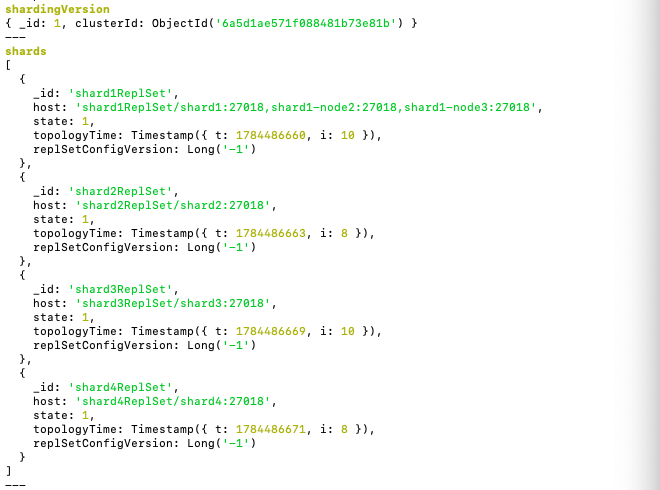
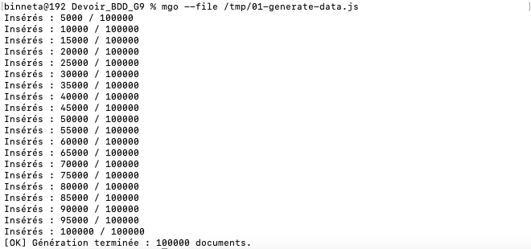
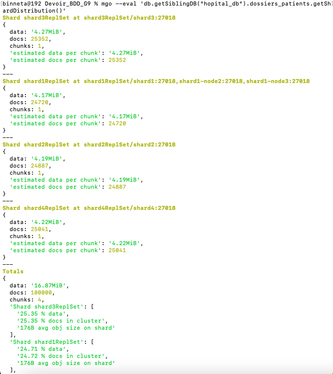
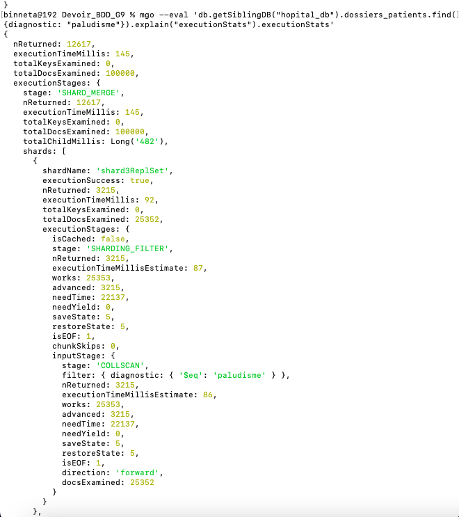
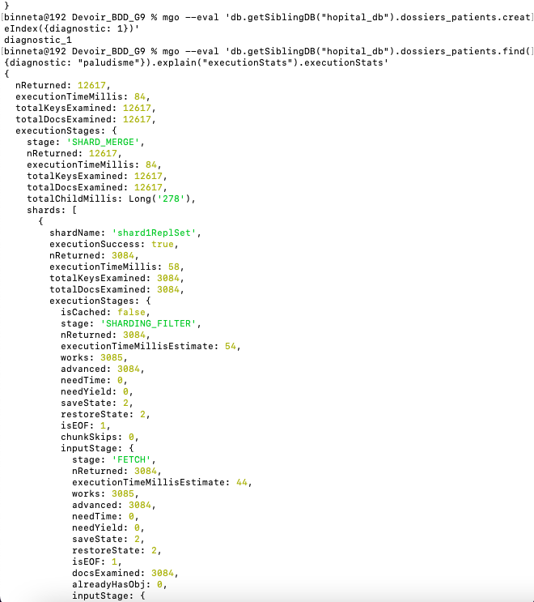
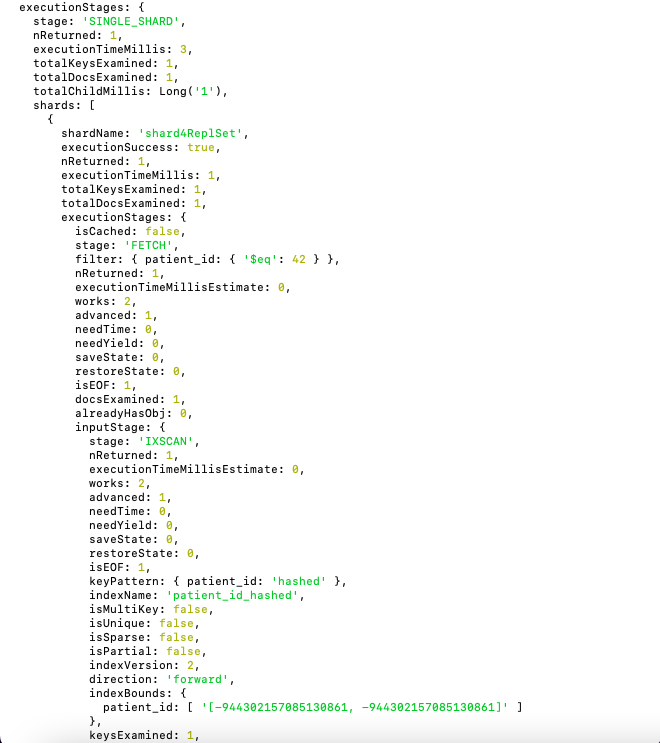
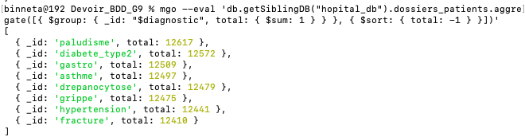
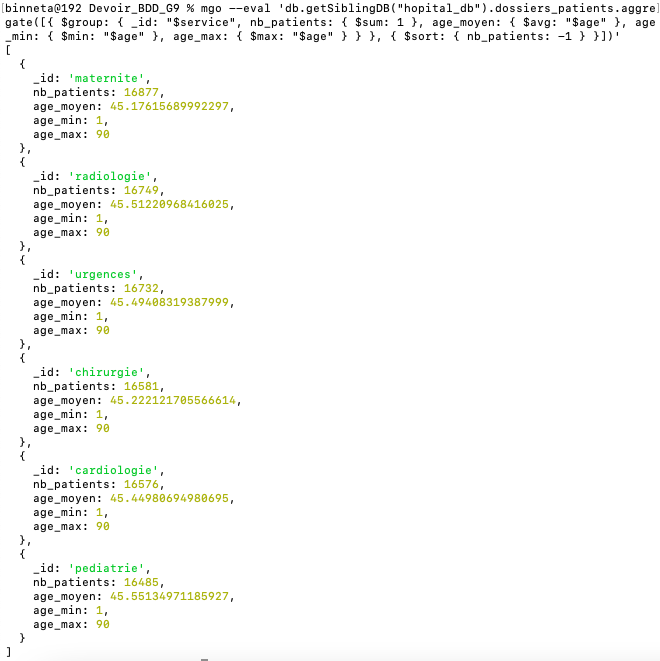

# Partie 5 — Performances et optimisation

*Plateforme de logs médicaux (Dossier Patient Partagé), cluster MongoDB shardé et sécurisé*

> Les captures d'écran citées se trouvent dans le dossier `captures_partie_5/`.

## 1. De quoi parle cette partie

Une base de données peut être parfaitement conçue et parfaitement sécurisée, et rester **lente**. Cette partie répond à une question simple : quand on cherche une information dans des dizaines de milliers de dossiers, combien de temps ça prend, et comment aller plus vite ?

Pour y répondre, on ne se contente pas d'affirmer « c'est plus rapide avec un index ». On le **mesure**, chiffres à l'appui, en demandant à MongoDB de raconter comment il a travaillé. Trois démonstrations structurent la partie :

- l'effet d'un **index** sur une recherche (le cœur du sujet) ;
- la différence entre une requête qui réveille **tout le cluster** et une qui vise **un seul shard** ;
- ce que le **pipeline d'agrégation** sait calculer côté serveur.

Le tout est mené sur le cluster commun du groupe : shardé (4 shards), sécurisé par Personne B (TLS + authentification), avec le shard1 à 3 membres hérité de la Partie 3.

## 2. L'environnement de test

### 2.1 Le cluster

Les mesures sont faites sur le cluster officiel du dépôt : 4 shards enregistrés auprès du routeur `mongos`, en MongoDB 8.0.26. Le shard1 est un replica set à 3 membres (`shard1`, `shard1-node2`, `shard1-node3`), les shards 2 à 4 sont mono-nœud.

Toutes les connexions se font **avec authentification et TLS**, impossible d'interroger la base sans compte ni certificat. Les opérations d'optimisation (création d'index, activation du profiler) relèvent de l'administration de la base ; faute d'un rôle applicatif dédié (`dbAdmin`) dans le RBAC métier, elles sont exécutées ici avec le compte `admin_root`. En production, on créerait un rôle d'administration de base applicative distinct du root, pour ne pas manier le passe-partout du cluster à chaque optimisation.

### 2.2 Le jeu de données

Sans volume, aucune mesure de performance n'a de sens : chercher parmi 3 documents ne coûte rien, avec ou sans index. On a donc généré **100 000 dossiers patients** dans la collection `dossiers_patients` de la base `hopital_db`, chacun avec un `patient_id` séquentiel, un nom, un prénom, un âge, un service, un diagnostic, une date d'admission et un hôpital.

Détail qui est déjà une première leçon de performance : les documents sont insérés par **paquets de 5 000** (`insertMany`) et non un par un. Insérer 100 000 fois individuellement, c'est 100 000 allers-retours réseau (plusieurs minutes) ; par paquets, c'est 20 allers-retours (environ une minute). Grouper les écritures, c'est déjà optimiser.

Le script de génération est fourni : `partie5/01-generate-data.js`.

## 3. La méthode de mesure : `explain("executionStats")`

Pour mesurer, on demande à MongoDB non pas le résultat d'une requête, mais le **compte rendu** de la façon dont il l'a exécutée. C'est ce que fait `explain("executionStats")`. Quatre chiffres reviennent à chaque fois :

- **le `stage`** : `COLLSCAN` (il lit tout, comme un annuaire en désordre) ou `IXSCAN` (il consulte un index, comme un annuaire trié) ;
- **`totalDocsExamined`** : combien de documents il a dû lire ;
- **`nReturned`** : combien il en a réellement trouvé ;
- **`executionTimeMillis`** : le temps pris.

Le rapport entre *examinés* et *retournés* est la mesure de l'effort gaspillé. Lire 100 000 documents pour n'en garder que 12 000, c'est 88 % de travail inutile.

## 4. Le sharding en action : la répartition des données

Avant de mesurer les recherches, on vérifie comment les 100 000 documents se sont répartis sur les 4 shards. La clé de sharding est `patient_id` en mode **haché** : chaque identifiant passe dans une fonction qui le projette de façon reproductible vers un shard.

Résultat : entre 24 720 et 25 352 documents par shard, soit **24,7 % à 25,4 %** chacun.

| Shard | Documents | Part |
|---|---|---|
| shard1ReplSet | 24 720 | 24,72 % |
| shard2ReplSet | 24 887 | 24,88 % |
| shard3ReplSet | 25 352 | 25,35 % |
| shard4ReplSet | 25 041 | 25,04 % |
| **Total** | **100 000** | **100 %** |

La répartition est quasi uniforme, jamais parfaite, et c'est justement la signature d'un vrai hachage. Comme des grains de riz jetés sur quatre assiettes : on obtient *à peu près* le même nombre partout, jamais exactement le même. Un déséquilibre aurait signalé une mauvaise clé de sharding (par exemple une clé sur un champ trop répétitif, qui aurait entassé les données sur un seul shard). Ici, la charge est bien étalée : c'est ce qu'on attend d'une clé hachée.

## 5. Le cœur du sujet : l'effet d'un index

### 5.1 Avant l'index, le COLLSCAN

On cherche tous les patients atteints de paludisme, sans aucun index sur le champ `diagnostic`.

MongoDB a examiné **100 000 documents** pour en retourner **12 617**, en **145 ms**. Le champ `totalKeysExamined` vaut 0 : aucun index consulté, il n'y en avait pas.

Deux observations propres au cluster shardé :

- le stage racine est `SHARD_MERGE` : la requête portant sur `diagnostic` (et non sur la clé de sharding), le routeur ne peut pas deviner quel shard détient les malades du paludisme. Il interroge donc **les 4 shards en parallèle**, puis fusionne leurs réponses. C'est un « scatter-gather » (éparpiller la question, rassembler les réponses) ;
- chaque shard fait son propre `COLLSCAN` sur ses ~25 000 documents (25 352 + 24 887 + 24 720 + 25 041 = 100 000).

Un chiffre mérite d'être expliqué à l'oral : `totalChildMillis` vaut 482 ms (la somme du travail des 4 shards), alors que le chrono global n'affiche que 145 ms. La différence vient du **parallélisme** : les shards ont travaillé en même temps. C'est le bénéfice du sharding — diviser la peine. Mais du gaspillage divisé par quatre reste du gaspillage : d'où l'index.

### 5.2 Après l'index — l'IXSCAN

On crée un index sur `diagnostic`, puis on relance **exactement** la même requête.

Le changement est net :

| Mesure | Avant (COLLSCAN) | Après (IXSCAN) |
|---|---|---|
| Documents examinés | 100 000 | **12 617** |
| Clés d'index consultées | 0 | 12 617 |
| Documents retournés | 12 617 | 12 617 |
| Temps d'exécution | 145 ms | **84 ms** |
| Travail gaspillé | 87 % | **0 %** |

Le ratio examinés/retournés passe de 8-pour-1 à **1-pour-1** : MongoDB ne lit plus un seul document inutile. Dans le détail de l'`explain`, on lit une pile de stages qui se comprend de bas en haut : `IXSCAN` (trouver les adresses dans l'index trié) → `FETCH` (aller chercher les dossiers complets à ces adresses) → `SHARDING_FILTER`. Sur chaque shard, `seeks: 1` : un seul saut dans l'index pour se poser sur « paludisme », puis lecture de la tranche contiguë (`indexBounds: ["paludisme", "paludisme"]`).

Une nuance honnête pour le rapport : le gain de temps (145 → 84 ms) est moins spectaculaire que le gain de lectures (100 000 → 12 617). C'est normal : même avec l'index, il faut toujours *récupérer* les 12 617 dossiers (le `FETCH`). La vraie économie, c'est le tri qu'on ne fait plus — le champ `needTime` passe de ~22 000 à 0 sur chaque shard, c'est-à-dire plus aucun document lu puis rejeté.

## 6. Requête ciblée contre scatter-gather

L'index accélère chaque shard, mais il ne dispense pas d'interroger les 4. Pour toucher un seul shard, il faut chercher sur **la clé de sharding elle-même**. On récupère le patient `patient_id: 42`.

Cette fois, plus de `SHARD_MERGE` mais un stage `SINGLE_SHARD`, avec **une seule** section dans la liste (`shard4ReplSet`). Les trois autres shards ne sont pas dérangés. Résultat : **1 document examiné, 1 retourné, 3 ms**.

Deux points remarquables :

- l'index utilisé s'appelle `patient_id_hashed` et on ne l'a jamais créé : il existe automatiquement depuis que la collection a été shardée sur clé hachée. Le sharding fournit gratuitement l'index sur sa propre clé ;
- dans `indexBounds`, MongoDB ne cherche pas `42` mais **le hash de 42** (un grand nombre : `-944302157085130861`). C'est la preuve concrète que le routeur traduit chaque `patient_id` en une adresse qui désigne un seul shard, le même mécanisme qui a éparpillé les 100 000 documents à ~25 % par shard.

Le triptyque final résume tout :

| Requête | Stage | Shards interrogés | Docs examinés | Temps |
|---|---|---|---|---|
| `diagnostic` sans index | SHARD_MERGE | 4 (tous) | 100 000 | 145 ms |
| `diagnostic` avec index | SHARD_MERGE | 4 (tous) | 12 617 | 84 ms |
| `patient_id` (clé de sharding) | SINGLE_SHARD | 1 seul | 1 | 3 ms |

L'enseignement central : **le choix de la clé de sharding décide si une requête réveille tout le cluster ou un seul shard.** Chercher sur la clé coûte 3 ms ; chercher sur autre chose, même avec un index, oblige à consulter les 4 shards.

## 7. Le pipeline d'agrégation

Jusqu'ici on a *cherché* des documents. L'agrégation permet de *calculer* sur eux, côté serveur, en une seule passe. Au lieu de rapatrier 100 000 dossiers pour les compter soi-même, on demande à MongoDB de faire le calcul et de ne renvoyer que le résultat.

### 7.1 Compter par diagnostic

L'opérateur `$group` regroupe les documents par un critère et calcule sur chaque groupe. Ici : regrouper par `diagnostic`, compter chaque groupe (`$sum: 1`), puis trier du plus fréquent au plus rare.

Résultat obtenu :

| Diagnostic | Nombre |
|---|---|
| paludisme | 12 617 |
| diabete_type2 | 12 572 |
| gastro | 12 509 |
| asthme | 12 497 |
| drepanocytose | 12 479 |
| grippe | 12 475 |
| hypertension | 12 441 |
| fracture | 12 410 |

Les 8 diagnostics totalisent bien 100 000, et le `12 617` du paludisme recoupe exactement le `nReturned` des requêtes précédentes : le jeu de données est cohérent.

### 7.2 Calculer, pas seulement compter

`$group` sait faire plus que compter : moyennes, minimums, maximums. On demande, par service, le nombre de patients, l'âge moyen et les âges extrêmes (`$avg`, `$min`, `$max`).

| Service | Patients | Âge moyen | Âge min | Âge max |
|---|---|---|---|---|
| maternite | 16 877 | 45,2 | 1 | 90 |
| radiologie | 16 749 | 45,5 | 1 | 90 |
| urgences | 16 732 | 45,5 | 1 | 90 |
| chirurgie | 16 581 | 45,2 | 1 | 90 |
| cardiologie | 16 576 | 45,4 | 1 | 90 |
| pediatrie | 16 485 | 45,6 | 1 | 90 |

L'uniformité des moyennes (toutes autour de 45) n'est pas un défaut : c'est la signature d'un tirage aléatoire uniforme des âges entre 1 et 90. Avec ~16 700 patients par service, chaque service couvre toute la plage d'âge.

### 7.3 Quand un index sert, et quand il ne sert à rien

Ces agrégations lisent **tous** les documents (elles regroupent la totalité de la collection). Un index sur `service` ou `diagnostic` ne les accélérerait donc **pas** : un index sert à sauter directement à une petite tranche de données, alors qu'ici il faut tout lire de toute façon. Rien à « sauter ».

La règle qui en découle : **un index accélère la sélectivité (trouver peu parmi beaucoup), pas le balayage complet (traiter tout).** Filtrer 12 % des documents, l'index gagne ; regrouper 100 %, il ne change rien.

La nuance experte : un index redeviendrait utile si on **filtrait avant de regrouper** — par exemple « âge moyen par service, uniquement pour la cardiologie ». Un `$match` sur un champ indexé placé *en tête* du pipeline réduirait le volume avant le `$group`. C'est le principe du « filtrer tôt » : mettre l'étape sélective au début pour que les suivantes travaillent sur moins de données.

## 8. Ce qu'il faut retenir

- Sur 100 000 documents, un index bien choisi fait passer une recherche de 100 000 lectures à 12 617, en supprimant tout le travail gaspillé.
- Le sharding divise la charge en travaillant les shards en parallèle, mais une requête qui ne porte pas sur la clé de sharding doit quand même interroger tous les shards (scatter-gather).
- Une requête sur la clé de sharding est chirurgicale : un seul shard, un seul document, quelques millisecondes.
- Un index n'aide pas partout : il accélère les recherches sélectives, pas les agrégations qui balaient toute la collection — sauf si on filtre avant de regrouper.

Pour notre plateforme médicale, la traduction concrète : les recherches fréquentes du quotidien (retrouver un dossier par son identifiant, lister les patients d'un diagnostic) doivent s'appuyer sur des index et, quand c'est possible, sur la clé de sharding — sous peine de faire ramer tout le cluster à chaque consultation quand le volume grandit.

## Annexe — Fichiers livrés

- `partie5/01-generate-data.js` — génération des 100 000 dossiers de test
- `captures_partie_5/` — les captures d'écran des mesures
