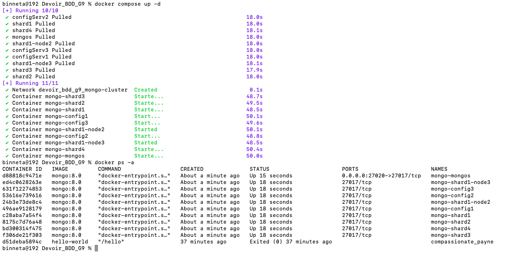
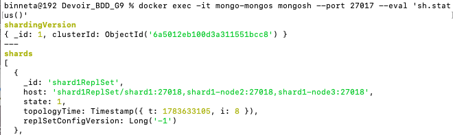
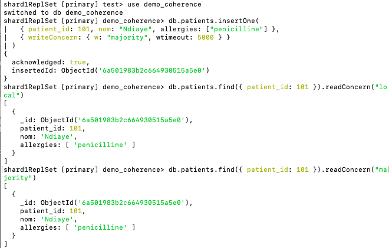
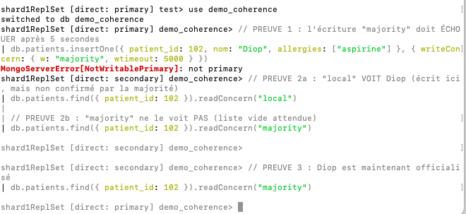
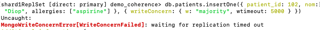
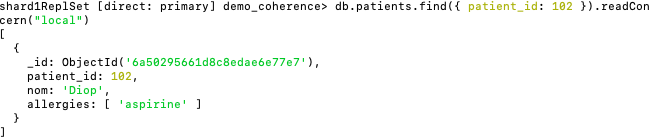
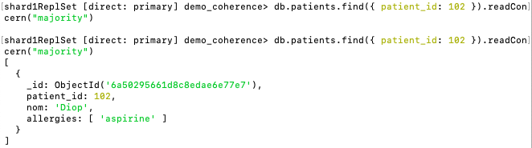

# Partie 3 — Cohérence des données

*les captures d'écran citées se trouvent dans le dossier `captures_partie_c/`)*

## 3.1 Le théorème CAP

Quand une base de données est répartie sur plusieurs serveurs, le théorème CAP dit qu'on ne peut pas tout avoir. Trois propriétés existent : la **cohérence** (tous les serveurs donnent la même réponse au même moment), la **disponibilité** (le système répond toujours, même si un serveur est en panne) et la **tolérance au partitionnement** (le système continue de marcher quand les serveurs n'arrivent plus à communiquer entre eux).

On ne choisit pas la troisième : les pannes réseau arrivent forcément un jour. Le vrai choix est donc entre les deux premières. Un système **CP** préfère bloquer quelques instants plutôt que de donner une information peut-être fausse. Un système **AP** préfère toujours répondre, quitte à donner une information un peu périmée. MongoDB est CP : si le serveur principal tombe, il met les écritures en pause le temps de désigner un remplaçant. Il préfère être juste que rapide.

## 3.2 ACID et BASE

CAP parle du système entier ; ACID et BASE parlent de ce qui se passe quand on écrit ou lit une donnée. **ACID**, c'est le contrat des bases SQL classiques : une opération réussit entièrement ou pas du tout, comme un virement bancaire — jamais d'entre-deux. C'est très sûr, mais lent quand plusieurs serveurs doivent se coordonner. **BASE**, c'est la philosophie NoSQL : le système répond presque toujours, et les copies finissent par se synchroniser — comme un message dans un groupe WhatsApp, que certains reçoivent tout de suite et d'autres dix secondes plus tard, mais que tout le monde finit par avoir. MongoDB se situe entre les deux, et nous laisse régler le curseur selon les besoins.

## 3.3 Et pour notre plateforme médicale ?

Ici, la cohérence n'est pas un détail technique : c'est une question de sécurité des patients. Si un médecin à Dakar note une allergie à la pénicilline et qu'un médecin à Thiès ouvre le dossier sans voir cette information, il peut prescrire un médicament dangereux. Attendre dix secondes que l'information se propage, c'est acceptable pour un like sur un réseau social, pas pour une allergie. Le choix CP de MongoDB correspond donc bien à notre besoin.

Une nuance quand même : toutes les données ne se valent pas. Une allergie, c'est vital. Un simple journal d'accès ("tel médecin a ouvert tel dossier à 14h32"), on en écrit des milliers par minute et en perdre un n'est pas grave. MongoDB permet justement de régler ce niveau de garantie donnée par donnée, grâce à deux paramètres, `writeConcern` et `readConcern`, qu'on étudie dans la section suivante.

## 3.4 Les niveaux de garantie : writeConcern et readConcern

MongoDB propose deux paramètres pour régler le compromis entre sécurité et rapidité, opération par opération. Le **writeConcern** répond à la question : "combien de confirmations j'exige avant de considérer qu'une écriture est réussie ?"

| Niveau | Signification | Risque | Vitesse |
|---|---|---|---|
| `w: 0` | Aucune confirmation attendue | Perte silencieuse possible | Très rapide |
| `w: 1` | Seul le serveur primaire confirme | Perte si le primaire tombe avant réplication | Rapide |
| `w: "majority"` | La majorité des membres du replica set confirme | Quasi nul | Plus lent |

À noter : depuis les versions récentes, `w: "majority"` est le réglage par défaut de MongoDB, ce qui confirme son orientation "cohérence d'abord". Une option complémentaire `j: true` exige en plus que l'écriture soit enregistrée dans le journal sur disque.

Le **readConcern** répond à la question inverse : "quel niveau de fiabilité j'exige sur ce que je lis ?"

| Niveau | Signification | Usage dans notre projet |
|---|---|---|
| `"local"` | Lit la donnée locale du serveur, même non confirmée partout | Statistiques, tableaux de bord |
| `"available"` | Comme local, encore plus permissif sur cluster shardé | Non utilisé |
| `"majority"` | Ne lit que ce que la majorité a confirmé | Allergies, diagnostics, prescriptions |
| `"linearizable"` | Garantie maximale de fraîcheur, lecture sur le primaire uniquement | Trop coûteux pour notre usage |
| `"snapshot"` | Vue cohérente pour les transactions multi-documents | Hors périmètre |

Pour notre plateforme, nous retenons donc : les **données critiques** (allergies, diagnostics) en écriture `w: "majority"` et lecture `"majority"` — quelques millisecondes de plus ne pèsent rien face au risque de perdre ou de rater une information vitale. Les **journaux d'accès**, très volumineux et peu critiques à l'unité, peuvent utiliser `w: 1` et `"local"` pour absorber le débit.

*Source : documentation officielle MongoDB (Read Concern, Write Concern).*

## 3.5 Adaptation de l'architecture pour la démonstration

En préparant cette partie, nous avons identifié une limite de l'architecture initiale : chaque shard était un replica set à **un seul membre** (choix fait pour économiser les ressources). Or, la "majorité" d'un seul membre, c'est ce membre lui-même : `w: "majority"` devenait alors identique à `w: 1`, et aucune différence entre les niveaux de garantie n'aurait été observable.

En coordination avec la Personne A, le **shard 1 a donc été étendu à 3 membres** (1 primaire + 2 secondaires, conteneurs `mongo-shard1`, `mongo-shard1-node2` et `mongo-shard1-node3`), configuration minimale pour qu'une majorité ait du sens (2 confirmations sur 3). Les shards 2, 3 et 4 restent à un membre pour limiter la consommation mémoire.

Le cluster compte désormais **10 conteneurs** : 1 routeur mongos, 5 replica sets (config servers à 3 membres, shard 1 à 3 membres, shards 2 à 4 à 1 membre chacun), soit 9 serveurs de données. C'est sur le shard 1 que porte la démonstration qui suit.

## 3.6 Démonstration pratique

Toute la démonstration a été réalisée sur un cluster monté localement (Docker Desktop sur macOS), en suivant la procédure d'installation de la Partie A.

### Mise en place

Le démarrage des 10 conteneurs (`docker compose up -d`) puis l'initialisation des replica sets et l'ajout des shards au routeur donnent un cluster opérationnel. La commande `sh.status()` confirme que les 4 shards sont enregistrés, et que le shard 1 est bien un replica set de 3 membres.





### Test 1 — Fonctionnement normal : tout le monde est d'accord

On se connecte au primaire du shard 1 et on enregistre une allergie en exigeant la confirmation de la majorité :

```javascript
db.patients.insertOne(
  { patient_id: 101, nom: "Ndiaye", allergies: ["penicilline"] },
  { writeConcern: { w: "majority", wtimeout: 5000 } }
)
```

Résultat : `acknowledged: true` — au moins 2 membres sur 3 possèdent la donnée, elle ne peut plus être perdue même si un serveur tombe. Les deux niveaux de lecture (`"local"` et `"majority"`) renvoient ensuite le même patient : quand le cluster va bien, la réplication est quasi instantanée et la cohérence forte est assurée.



### Test 2 — Panne simulée : la différence devient visible

Pour voir ce qui se passe quand la réplication est cassée, on gèle les deux secondaires avec `docker pause` : le primaire se retrouve seul, la majorité (2 sur 3) devient impossible à atteindre.

**Première observation (inattendue mais très instructive)** : un primaire qui reste isolé de la majorité pendant plus de dix secondes **abdique tout seul**. Le replica set n'a alors plus aucun primaire et refuse toute écriture (`NotWritablePrimary: not primary`). MongoDB préfère devenir indisponible en écriture plutôt que de risquer une incohérence — c'est exactement le comportement CP de la section 3.1, vu en conditions réelles. Pour dérouler la suite de la démonstration sans être interrompus par cette abdication, nous avons temporairement augmenté le délai d'élection (`electionTimeoutMillis`).



**L'écriture "majority" échoue.** Avec le primaire seul (mais toujours en poste), l'insertion d'une nouvelle allergie en `w: "majority"` échoue après 5 secondes :

```
MongoWriteConcernError[WriteConcernFailed]: waiting for replication timed out
```

Le détail le plus intéressant est dans la réponse : `n: 1`. Le document a bien été écrit **localement** sur le primaire, mais MongoDB refuse de dire "c'est réussi" tant que la majorité n'a pas confirmé. Le writeConcern ne contrôle donc pas l'écriture elle-même, mais la garantie qu'on peut lui accorder.



**La même donnée, deux réponses différentes.** Juste après, on lit ce patient avec les deux niveaux :

- `readConcern: "local"` → le patient **apparaît** (il existe sur ce serveur)
- `readConcern: "majority"` → **liste vide** (aucune majorité ne l'a confirmé, le système refuse de le présenter comme fiable)

C'est le cœur de notre sujet, observé en direct : en niveau "local", un soignant pourrait lire une information qui n'est pas encore garantie et pourrait être annulée. En niveau "majority", le système avoue honnêtement qu'il ne peut pas encore la certifier.





### Test 3 — Retour à la normale

On dégèle les deux secondaires (`docker unpause`). En quelques secondes, ils rattrapent leur retard de réplication, et la lecture en `"majority"` renvoie enfin le patient : la donnée est désormais détenue par la majorité, elle est officialisée et ne peut plus disparaître (visible sur la capture précédente : la même requête, vide avant, pleine après).

### Ce qu'il faut retenir

Ces tests confirment le compromis annoncé dans la théorie : `w: "majority"` et `readConcern: "majority"` garantissent qu'une donnée critique lue est une donnée sûre, au prix d'un ralentissement, voire d'une indisponibilité assumée quand la majorité est injoignable. Pour une plateforme de dossiers médicaux, c'est le bon choix : entre une information rapide et une information vraie, on choisit la vraie.
